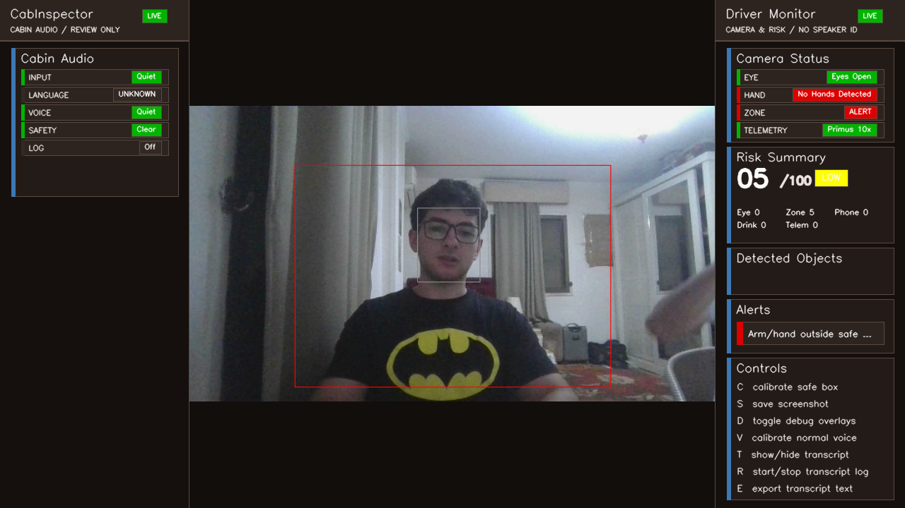
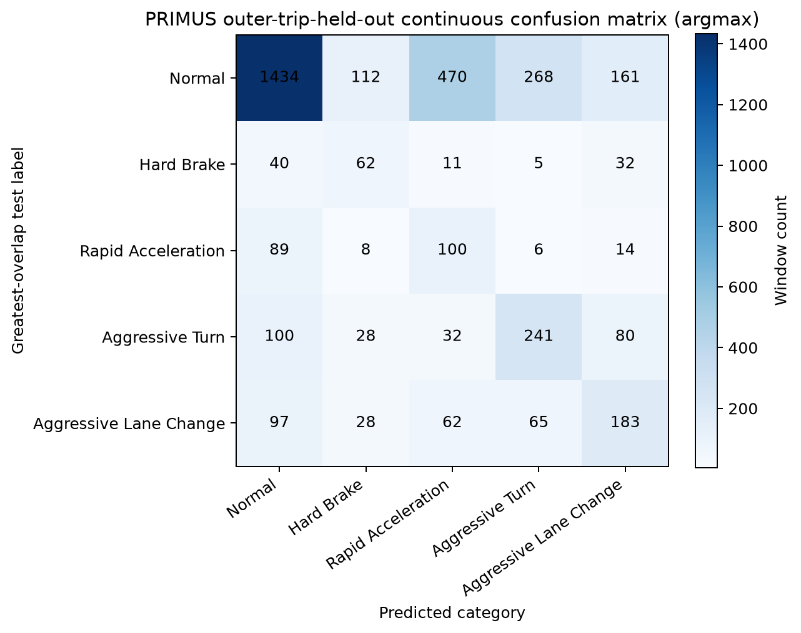
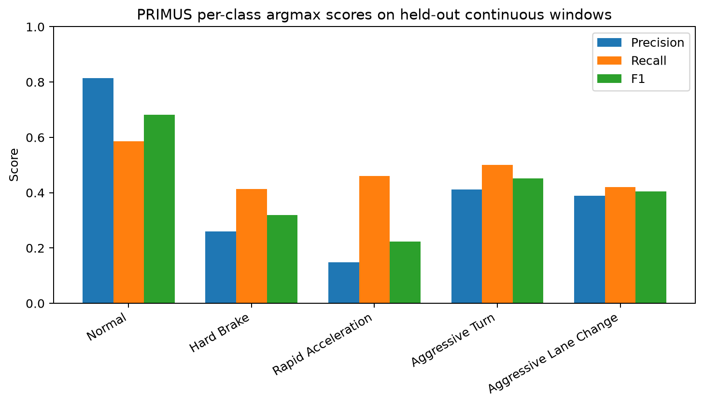
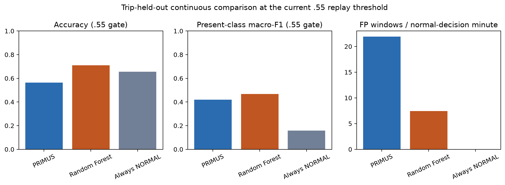
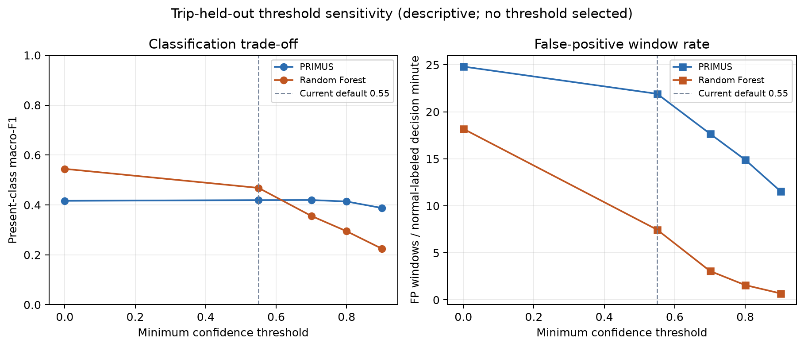
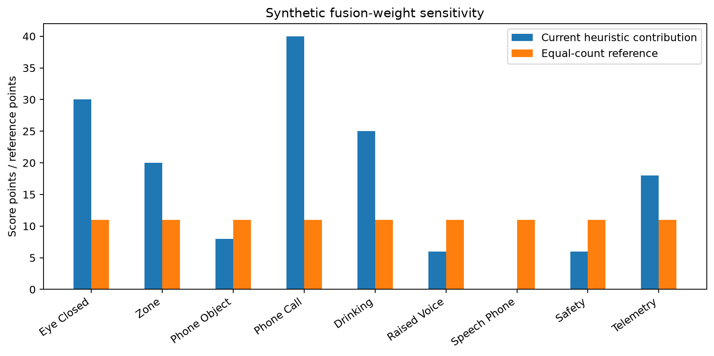
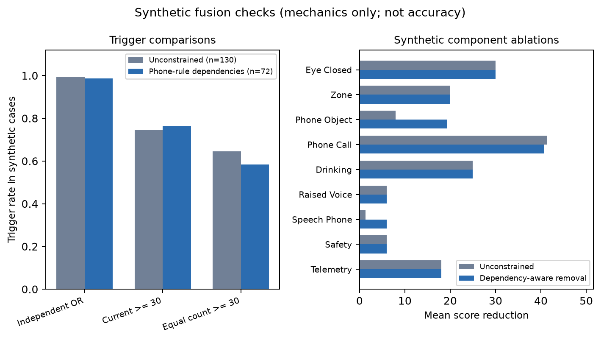
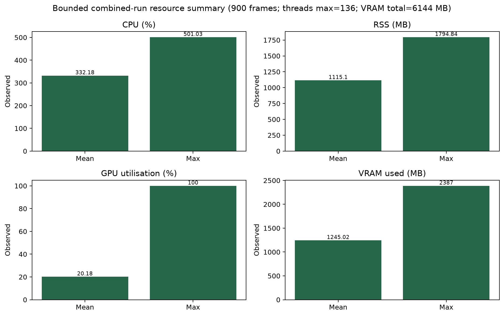

# CabInspector

**Ahmed Hossam**  
**Module / project template:** CM3020, AI 4.1 - Orchestrating AI models to achieve a goal  
**Report status:** Current evidence revision, 27 September 2026

# Chapter 1: Introduction

## 1.1 Background and motivation

I built CabInspector as a practical AI system for reviewing driver behaviour and ride quality. I designed it to help a fleet manager, ride-hailing operator, or safety reviewer find moments in a journey that may need a closer look. The system organises uncertain evidence for human review and leaves the judgement to the reviewer; it does not decide that a driver is at fault, diagnose a medical condition, or make employment decisions.

One sensor rarely tells the whole story. A phone-shaped object may be mounted or belong to a passenger; a loud sound may be road noise, a horn, or an unrelated conversation; and a sudden motion may come from the road rather than the driver. I treated this as an evidence-orchestration problem. CabInspector brings together a cabin-facing camera, optional audio, and a replay of public telemetry, while showing where each signal comes from and what it can and cannot tell us.

## 1.2 Project concept and selected template

I chose the CM3020 AI 4.1 template, *Orchestrating AI models to achieve a goal*. It fits my project because the result comes from combining specialist models with decision logic I wrote, rather than relying on a single model. My prototype uses pretrained models from different data domains:

- YOLOv8 and MediaPipe models for visual objects and landmarks;
- YAMNet and Faster-Whisper for sound context and bilingual speech; and
- PRIMUS for pretrained inertial representations.

My main contribution is the orchestration layer. I keep visual, audio, and telemetry evidence separate, apply context and persistence rules, show bounded risk contributions, and bring the results together in one review dashboard. For example, my phone-use rule requires phone, head, and hand context. Speech on its own adds no phone-use risk; it only reinforces a phone condition already confirmed visually. I made this choice to avoid treating one uncertain signal as a confident decision.

## 1.3 Aim and objectives

I aim to design, implement, and evaluate an explainable multimodal prototype that helps a human reviewer inspect possible driver-behaviour and ride-quality concerns.

I set these objectives:

1. implement a local camera pipeline for eye status, safe-zone movement, phone context, and drinking context;
2. add optional audio analysis for sound events, calibrated volume, bilingual transcription, and configured safety categories;
3. transfer a pretrained PRIMUS encoder to five public telemetry event categories;
4. combine the source states in one dashboard with structured event logging and bounded risk contributions;
5. make raw audio non-persistent by default, keep transcript storage opt-in, and exclude transcript text from the central log; and
6. evaluate both working behaviour and failure boundaries instead of presenting unlabelled demonstrations as accuracy.

## 1.4 Scope and boundaries

I run the application locally on my development laptop. The camera and microphone can use live input, while telemetry currently replays public recorded trips on a timer; I have not built a live phone-sensor adapter. The evaluation does not support a live-deployment claim. During normal use, audio stays in memory. I made transcript recording a separate, explicit action, and the central event log stores categories, confidence, timing, and state rather than transcript text.

I use five voice levels: quiet, low, normal, high, and very high. They describe calibrated signal volume measured with RMS/dBFS; they do not tell me a speaker's emotion, aggression, personality, or identity. Alerts are prompts for review, not proof of misconduct, intent, medical state, or legal fault.

## 1.5 Report structure

In Chapter 2, I review work on visual and audio systems, telemetry, explainability, naturalistic driver monitoring, and responsible AI. Chapter 3 explains my design and requirements; Chapter 4 describes how I implemented the system. In Chapter 5, I evaluate it with software tests, telemetry results, sensitivity comparisons, and resource measurements. Chapter 6 reflects on what I achieved, what remains limited, and what I would do next.

# Chapter 2: Literature Review

I use the literature to connect driver monitoring with my design choices.

## 2.1 Driver monitoring as an uncertain multimodal problem

Reading the driver-monitoring literature changed how I framed CabInspector. Camera systems can be useful, but real driving brings changes in lighting, occlusion, head pose, seating position, and the gap between controlled and naturalistic conditions [13]. Multi-sensor datasets offer richer ground truth than a single webcam, but they also need careful synchronisation, calibration, and annotation. I could not reproduce that scale, so I focused on a smaller, traceable orchestration problem and documented the coverage I am missing.

Ortega et al. [18] describe the work behind the Driver Monitoring Dataset, with synchronised cameras, RGB, depth and infrared channels, calibration, annotation, and volunteer management. It gives researchers much broader evidence than I have: my prototype uses one webcam and three public telemetry trips. Drive&Act extends this kind of benchmark to 12 hours, six views, and 83 hierarchically labelled activities [31]. It shows how much richer temporal and camera coverage is needed to study fine-grained actions than I can provide with one laptop camera.

Baltrusaitis et al. [19] identify representation, translation, alignment, fusion, and co-learning as key challenges in multimodal learning. I do not learn a joint representation. Each CabInspector pipeline produces its own source-labelled state, which I combine late with explicit rules. That keeps the evidence easy to inspect, but it does not solve timing mismatch or correlated errors; both still need labelled evaluation.

Adding more sensors does not automatically make a decision more trustworthy. The microphone may pick up a passenger, the camera may lose the driver's face, and the IMU model may mistake road motion for a learned event. I treat each modality as a separate source of evidence and keep its label visible. This follows explainable-AI work that treats the ability to inspect and question a system as part of responsible deployment, rather than a cosmetic feature [10].

## 2.2 Visual perception and the gap between objects and actions

Viola and Jones introduced a fast boosted-cascade method for object detection [1]. I kept Haar cascades as a fallback for face and eye processing so the prototype can still run if a newer landmark model is unavailable. This fallback does not provide robust driver-state recognition: face angle, glasses, lighting, and occlusion can all affect it.

MediaPipe Hands supports real-time hand tracking on a device [2], while BlazePose provides efficient body landmarks [3]. I chose them because I could build the project-specific rules around geometry: for example, checking whether a wrist leaves a calibrated safe zone or whether a hand is near a detected phone and ear. A reviewer can inspect these rules more easily than an unexplained action label, although the results still depend on camera position and driver pose.

I use YOLOv8 [4] with the COCO vocabulary [5] to detect objects. Finding a bottle, cup, or phone does not by itself tell me what someone is doing: a phone may be mounted, held by a passenger, or only briefly visible. I combine the object's bounding box with head and hand context before flagging possible phone use. For drinking, I also require a container near the mouth and contact with a hand. These checks help keep the alerts within a human-review role.

Buolamwini and Gebru [25] found performance disparities across demographic groups in commercial facial gender-classification systems, along with imbalances in their evaluation data. Their work is about a different task, so it does not show that CabInspector's MediaPipe components have the same disparities. It does remind me not to infer equal performance from one webcam demonstration. I would need stratified testing before making subgroup or fairness claims.

Temporal context also matters for action recognition. Zhou et al. [33] treat distracted driving in untrimmed, multi-view video as a temporal-localisation problem: they classify video clips, combine views, and post-process the results into action intervals. CabInspector's frame-level geometry and persistence counters are much simpler; they can confirm that a rule has remained active but do not model a full action sequence or estimate its start and end. I use the alerts as prompts for review, not as validated action labels.

## 2.3 Audio events, multilingual speech, and privacy

AudioSet provides a broad, human-labelled sound-event ontology [6], and YAMNet is a pretrained classifier built around it [7]. I use YAMNet to add context about speech, raised voices, horns, sirens, music, and quiet. It cannot identify a speaker or tell me that speech is a phone call, so speech alone never triggers a phone-use alert in my fusion logic.

Whisper showed how large-scale weak supervision can support multilingual speech recognition [8]. I use Faster-Whisper to run Arabic, English, and mixed utterances locally. Short dialect phrases, code-switching, background noise, and microphone differences can still affect its output. My keyword safety layer can also misread a transcription error or harmless phrase as a category, so I present these matches as review alerts rather than claiming to understand the speaker's meaning.

I reviewed the Egyptian Arabic-English ArzEn corpus, which contains 12 hours of spontaneous bilingual speech from 38 participants [20]. A separate ArzEn study reported a 32.1% baseline WER and a best result of 30.6% for its systems [21]. QASR adds 2,000 hours of multi-dialect broadcast speech [22], although broadcast audio differs from an in-cabin recording. Together, these studies show why dialect, code-switching, transcription references, and test conditions matter. Their WER results cannot be compared directly with my Faster-Whisper setup because the models, corpora, and recording conditions differ. Koenecke et al. [23] found group disparities in commercial US-English ASR systems. That is not evidence about Arabic or Faster-Whisper, but it supports testing by condition and subgroup instead of reporting only one pooled WER.

I treated privacy as a design requirement. In normal use, the application does not save raw audio. Users can hide a temporary transcript, and saving transcript text to CSV requires a separate control. I also refer to the NIST AI Risk Management Framework when documenting intended use, limitations, evaluation, and human oversight [12].

## 2.4 Telemetry transfer and domain mismatch

The public Driving Events Dataset contains linear acceleration, gyroscope data, and 169 annotated events from three trips [9]. Its labels and trip boundaries make the data reproducible, but the collection is narrow: one driver, one vehicle, one phone, and a few journeys. I chose it because I could hold out whole trips during evaluation, not because it represents every taxi or phone placement.

I first trained a Random Forest for telemetry and kept it as a baseline. Because that model alone did not meet the template's requirement to use an externally pretrained model, I also evaluated PRIMUS, an IMU encoder pretrained with self-supervised, multimodal, and nearest-neighbour signals [11]. The PRIMUS study evaluates transfer to downstream tasks, but does not use CabInspector's vehicle-event labels. I froze its encoder and fitted a small head to the public event categories. This gave me a transfer experiment, while leaving the main domain question open: PRIMUS was not originally trained to recognise vehicle motion.

## 2.5 Human oversight, inclusive design, and privacy

Parasuraman, Sheridan, and Wickens [24] distinguish automating information gathering and analysis from automating decisions and actions. I automated sensing and intermediate interpretation, then left the final judgement to a person who reviews a bounded priority score. This keeps human review in the loop, but does not show that reviewers will understand or use alerts appropriately. I have not measured trust, complacency, workload, or usability.

The Inclusive Design Research Centre asks designers to consider differences in ability, language, culture, gender, and age [27]. Design justice goes further: people affected by a design should help lead it and hold it accountable [26]. The Sierra Leone Ministry's Radical Inclusion in Schools policy addresses barriers that exclude learners [30]. I use it to prompt questions about structural barriers, not to claim that my taxi-monitoring prototype achieves radical inclusion. Without stakeholder participation, accessibility expertise, and representative testing, my inclusion audit remains provisional.

WCAG 2.2 advises against using colour as the only way to communicate information [28], so I pair dashboard colours with text labels. WCAG is a web-content standard, however, and I have not assessed whether my OpenCV desktop interface conforms to it. It still needs a proper accessibility review. For a possible UK workplace deployment, the ICO warns that continuous audio and video monitoring is intrusive, needs strong justification, and may require a DPIA [29]. I use that guidance as a prompt for further review, not as legal advice; the relevant jurisdiction, lawful basis, notices, retention, access, and worker and passenger rights would all need specialist consideration.

## 2.6 Critical synthesis

Four themes from these sources shaped my design. First, naturalistic conditions and data coverage matter more than one impressive score [13], [18], [31]. Second, multimodal systems need to handle alignment and interaction; adding channels does not guarantee better evidence [19]. In a decision-level fusion study, Roitberg et al. [32] found that product and maximum-score rules often outperformed simple averaging, but the stronger method varied with the task and number of views. Their study combines learned class scores from multiple camera views; my system adds hand-set risk points across vision, audio, and telemetry. The methods and outputs are not directly comparable, but their findings reinforce why I must evaluate my own aggregation rule instead of assuming that more sources improve it. Third, ASR results depend on dialect, code-switching, recording conditions, and subgroup coverage [20]-[23]. Finally, automation should leave meaningful decisions and oversight with people [10], [12], [24], and inclusive design calls for participation from affected communities [26], [27]. I applied these ideas through source-specific states, context checks, persistence or confidence gates, clear risk contributions, and explicit privacy controls in one local dashboard.

This review also helped me set the limits of my claims. I do not yet have representative labelled visual or audio data, speaker attribution, live phone telemetry, or a human-review study. I have treated these as open evaluation needs rather than assuming that my prototype will generalise.

# Chapter 3: Design

## 3.1 Design goals and requirements

I designed CabInspector to run locally on one laptop, keep working when optional inputs are unavailable, combine pretrained models from different domains, and give reviewers enough context to question an alert. I recorded the provisional requirements in `docs/requirements_traceability.md` and the possible barriers in `docs/inclusion_audit.md`. I based these documents on desk research; I did not conduct stakeholder interviews.

I translated those needs into technical and ethical requirements: identify each source, bound the risk score, show uncertainty, degrade gracefully when inputs fail, minimise stored data, support bilingual settings, keep setup reproducible, and distinguish replay data from live sensing.

**Table 3.1 - Requirements-to-evidence traceability summary.** The full 15-ID matrix is in `docs/requirements_traceability.md`. These are provisional desk-based requirements, not interview findings.

| Stakeholder need | System requirement | Design decision | Verification method and current status |
|---|---|---|---|
| Driver: understand when monitoring is active and what an alert means | Show source, status, and reviewer-facing uncertainty | Source-labelled panels and bounded risk breakdown | UI smoke and contract tests pass; comprehension/usability study missing |
| Driver: avoid punitive or overconfident judgement | Do not describe alerts as proof or automate legal/employment action | Human-review-only framing and heuristic score | Code/report boundary verified; stakeholder policy acceptance missing |
| Driver/passenger: minimise speech and video retention | Raw audio off by default; transcript storage opt-in; no transcript in central log | Separate transcript controls and metadata-only event log | Privacy tests and 49-field audit pass; signage/retention policy not deployment-validated |
| Passenger: not be mistaken for the driver or speaker | Do not infer speaker identity or passenger intent | `NO SPEAKER ID` cue; audio supplies context only | UI cue and code path verified; passenger-specific validation missing |
| Fleet/ride-hailing operator: review an incident efficiently | Preserve timestamped source evidence and status | Structured event log, optional screenshots, replay status | Schema and smoke checks pass; operator-workflow study missing |
| Human safety reviewer: trace alerts to evidence | Expose contributing source states and rule context | Separate source states and risk contributions | Unit contracts pass; no representative reviewer study |
| Drivers with language/access needs: avoid English-only or colour-only interaction | Provide bilingual configuration and readable non-colour cues | Arabic/English path, text-plus-colour status, optional modalities | Arabic rendering tests pass; formal WER/CER and accessibility review missing |
| System operator/assessor: reproduce setup and understand hardware limits | Pin model assets and report resource use | Checksum manifest, setup tool, bounded instrumented runs | Four model checks and three bounded runs verified; thermal/multi-hardware evidence missing |

In the table, I separate checks I implemented from questions that need people to answer. Needs I attributed to fleet managers, operators, passengers, and reviewers remain assumptions until I can consult those groups through an approved study.

**Figure 3.1 - CabInspector multimodal architecture.** The architecture separates live webcam and microphone paths from the public recorded telemetry replay before sending source states to shared rules, the dashboard, and privacy-bounded outputs.

## 3.2 Overall architecture

I organised the application around `src/video/driver_visual_prototype.py`. The visual pipeline processes camera frames for Face Mesh eye ratios, pose and hand landmarks, Haar fallback detections, and periodic YOLO object detections. A single microphone stream feeds the audio workers for YAMNet, loudness, and optional transcription. The telemetry path precomputes predictions from public trips and releases them along a scaled replay timeline.

I keep the three pipelines separate until each produces a source-specific state. Shared logic then applies validity and context checks, smoothing, confidence gates, and bounded risk contributions. The dashboard receives the current state, not the telemetry ground-truth labels. This separation lets the camera loop continue if transcription fails and keeps a replayed telemetry event identifiable as telemetry.

**Table 3.2 - Model/component map.** The table gives each component's source, licence evidence, runtime, data path, role, and current limit. A licence identified for upstream code is not assumed to cover every separately downloaded model asset.

| Domain / component | Source, licence, and runtime | Input to output | Role and current limit |
|---|---|---|---|
| Visual: MediaPipe Face Mesh, Pose, and Hands | MediaPipe [2], [3], [15]; Apache-2.0 repository code. Python MediaPipe/OpenCV. Individual bundled model-asset terms are not separately inventoried. | Live camera frames to face, body, and hand landmarks | Supports geometry and eye-state rules; sensitive to pose, lighting, glasses, and occlusion |
| Visual: YOLOv8n object detector | Ultralytics [4], [14]; AGPL-3.0 upstream option. Ultralytics/PyTorch; OpenCV provides camera and Haar fallback support. | Camera frames to object boxes and fallback face/eye detections | Finds phones and containers; COCO coverage is not action recognition |
| Audio: YAMNet classifier | AudioSet [6], TensorFlow YAMNet [7]; Apache-2.0 implementation. This MediaPipe-hosted TFLite asset's specific redistribution licence is unverified. LiteRT. | Microphone waveform to sound-event categories | Provides speech, horn, siren, music, and quiet context; cannot identify a speaker or intent |
| Audio: Whisper with Faster-Whisper | Whisper [8], [16]; MIT code/weights and MIT Faster-Whisper wrapper. CTranslate2. | In-memory utterance to Arabic/English text | Supports bilingual review; dialect, noise, and formal WER/CER remain unmeasured |
| Telemetry: frozen PRIMUS plus linear event head | PRIMUS [11], [17]; CC BY-4.0 checkpoint and BSD-3-Clause-Clear source code per retained provenance. PyTorch. | Public six-channel, five-second replay windows to five event categories | Provides transferred IMU evidence; it is not a live phone adapter and has domain mismatch |
| Fusion: project-authored rules and bounded risk | CabInspector code; no separate pretrained model. Python rule functions. | Source states to explanations, alerts, and a 0-100 priority score | Makes evidence inspectable; weights are heuristic and the score is not a probability |

I found two licensing questions that still need review before publication. Ultralytics offers YOLOv8 software and weights under its AGPL-3.0 option, with separate enterprise terms [14]. I have not chosen a licence for the whole project. My retained asset record also does not identify the exact redistribution terms for the MediaPipe-hosted YAMNet TFLite file, so I have not assumed that the TensorFlow reference implementation's licence applies to that converted asset. I excluded model binaries from the source archive.

## 3.3 Visual design

I use Face Mesh when it is available and keep Haar-based eye processing as a fallback. I repaired the Face Mesh constructor to match the installed MediaPipe API. The system smooths eye ratios and waits for a run of closed-eye frames before increasing the counter; the alert itself needs a longer persistent run. I use pose and hand landmarks to support a user-calibrated safe zone. YOLOv8 runs periodically, and I limit targeted phone searches to smaller regions to keep the dashboard responsive.

I pair sidebar colours with text labels. In the compact layout, the Risk Summary shows the risk level and names all five source contributions, so users do not have to rely on colour alone.

I only flag possible phone use when I detect a phone near an ear and a hand contact point. For drinking, I require a container near the mouth and hand contact. These are spatial rules I wrote, not pretrained action-recognition models. Their main weakness is sensitivity to the setup: thresholds that work for one camera, seat, pose, object size, or lighting condition may not work for another.

## 3.4 Audio and privacy design

I use `SpeechAnalysisPipeline` to coordinate one microphone stream, YAMNet, `LoudnessAnalyzer`, Faster-Whisper, a bilingual safety classifier, and bounded worker queues. Its energy gate keeps a short pre-roll buffer in memory, which helps preserve a quiet initial Arabic consonant. The pipeline starts an utterance only when the energy conditions are met, and runs transcription separately from capture and sound classification.

I compare RMS/dBFS with an explicit normal-speaking calibration to assign one of five volume levels; I do not use it to infer emotion. I use YAMNet categories as context only. Transcript display and saving are separate controls, and saving is opt-in. The event log records `transcript_visible` and speech-analysis status, but not transcript text. For resource tests, I can also disable automatic screenshots so camera frames are not saved.

## 3.5 Telemetry replay design

I implemented telemetry as a prediction-only replay of public data. PRIMUS processes six-channel, five-second windows resampled at 200 Hz. I send the dashboard the predicted category, confidence, trip, elapsed replay time, and active state, but not the source labels, raw sensor arrays, or private phone data. The trip and replay speed are explicit environment settings. PRIMUS with my linear head is the default; I also kept the Random Forest as a selectable baseline.

This let me demonstrate orchestration without claiming to have a live phone sensor. Complete event-centred windows are easier to handle than a real sliding-window stream, so I added a separate offline evaluator to measure the harder continuous case on public data.

## 3.6 Fusion and risk

I designed the 0-100 risk score as a bounded review priority, not a probability. It sums source contributions and caps the total. Persistent eye closure can add up to 30 points, safe-zone movement 20, a phone object 8, phone-call context 40, drinking 25, raised voice 6, configured safety categories 6-20, and telemetry 10-18 depending on the event.

I kept weak evidence from silently becoming a strong conclusion. Speech alone adds no points; it can add six only when the visual phone-call condition is already present. I also cap telemetry so one motion prediction cannot outweigh persistent visual evidence. The dashboard shows source status, the risk breakdown, alerts, controls, and a normal, moderate, or high review label.

Some inputs to this sum are related. A phone-call state requires the same detected phone that contributes the separate eight-point phone-object score; speech can add another six only after the phone-call rule is met. This avoids speech-only phone alerts, but it can still count one visual event through more than one term. The risk weights and 30/65 review boundaries came from prototype tuning, not stakeholder-agreed costs or labelled risk outcomes. I therefore present the score as a review priority, not calibrated risk.

**Figure 3.2 - Evidence, privacy, and alert decision flow.** The flow separates model output, context checks, persistence/confidence, source-labelled state, bounded contribution, dashboard feedback, and opt-in transcript storage.

## 3.7 Outputs and failure handling

I record timestamps, source states, model names, confidence, alert flags, risk score, and final status in `events_log.csv`. I exclude transcripts, raw audio, raw sensor arrays, and source ground-truth labels. Automatic screenshots support interactive review, but I can disable them during evaluation. On shutdown, the application releases the camera, event log, MediaPipe components, YOLO executor, and optional audio pipeline. I also added a frame limit so I can test cleanup without relying on someone to close the window.

**Table 3.3 - Storage and consent boundary.** The normal path minimises retention, while explicit controls make any sensitive export visible.

| Artifact | Normal behaviour | Explicit action | Current verification |
|---|---|---|---|
| Raw microphone audio | In-memory only | No normal save path | Audit: no new audio files |
| Transient transcript | Temporary; visibility toggle | `T` toggles display | Transcript-control tests pass |
| Transcript CSV/export | Off by default | `R` records; `E` exports | CSV unchanged; storage tests pass |
| Central event log | State, confidence, timing, risk only | No transcript text | 49-field audit passes |
| Camera screenshots | Manual or alert evidence | `S` saves; alerts may capture | Disabled in resource runs |
| Public telemetry | Prediction-only replay | No private phone input | Evaluator saved no arrays |

# Chapter 4: Implementation

## 4.1 Implementation organisation

I implemented CabInspector in Python 3.11 and separated the camera, audio, telemetry, and evaluation code. The dashboard coordinates those components, while the decision functions can be exercised independently without opening a camera or microphone. I used OpenCV, MediaPipe, and Ultralytics for vision; LiteRT and Faster-Whisper for audio; and PyTorch and scikit-learn for the inertial path. On my test machine CTranslate2 could access CUDA, but the PyTorch build was CPU-only, so the two model paths did not share the same acceleration.

## 4.2 Visual algorithms and camera loop

In fast-demo mode, I process 640 x 360 camera frames and keep the MediaPipe Face Mesh, Pose, and Hands objects alive between frames. I run eye analysis every third frame, pose analysis every third frame, and hand analysis every second frame; standard mode runs them on every frame. A missed detector frame reuses the last available pose or hand result for a limited number of frames, which saves time but can make the displayed state briefly lag behind movement.

For Face Mesh eye state, I calculate a ratio for each eye by dividing the mean distance between two upper/lower eyelid landmark pairs by the distance between the eye's horizontal landmarks. I average the available left and right ratios, keep the most recent five values, and use their median to smooth short fluctuations. Ratios at or above 0.18 reset the closed-eye run; ratios at or below 0.11 extend it, while values between those limits decay the counters. I require three consecutive closed-range frames before increasing the accumulated counter, and the alert waits until that counter reaches ten. This is a temporal rule over frame measurements, not a trained sequence classifier. If Face Mesh is unavailable, I fall back to Haar face and eye cascades; in that path, a detected face with no detected eye is ambiguous and can be mistaken for closure.

I start with a virtual safe-zone box covering 20-80% of frame width and 20-95% of frame height. Pressing `C` recalibrates it from the current shoulder, elbow, and wrist landmarks, expanding their bounding rectangle by 70 pixels and clipping it to the frame. Each frame I test the shoulders, elbows, wrists, and available hand-centre/wrist points against that box. Any point outside counts as a raw violation. A counter smooths this signal and the risk contribution rises by five points per count to a maximum of 20. The box is a user-calibrated geometry; it is not a learned model of safe driving posture.

I run YOLOv8n every 20 frames in fast-demo mode and every six frames in standard mode. Phone searches run more often (every eight frames in fast-demo) on at most two small regions around the head, ears, or tracked hands. I add head context (0.35, plus up to 0.12 for box overlap) and hand context (0.25) to the detector confidence; the resulting score must exceed 0.34 in fast-demo or 0.32 in standard mode before I keep a phone box. The higher-level phone-call rule then requires a detected phone within 145 scaled pixels of an ear and a hand contact point within 220 scaled pixels of that box. For drinking, I require a bottle/cup-like box within 190 scaled pixels of the mouth and a hand contact point near the object. These pixel thresholds scale with image size but still depend on camera placement and pose.

To keep YOLO from blocking the display loop, I submit each job to a single-worker executor using copies of the current frame, phone-search regions, pose points, and hands. The main loop polls the one pending future and will not submit another until it finishes. I reuse general-object detections until the next scheduled full run and retain phone detections for up to 18 frames in fast-demo (seven in standard mode). I do not attach a frame timestamp to the result or reject it for age, so a slow result can be combined with newer pose/hand landmarks. This is a known source of stale or misaligned evidence; I left the detector behavior unchanged and do not treat it as accuracy evidence.

I repaired a startup error in Face Mesh by removing the unsupported `model_complexity` argument. I verified direct construction and a dashboard import. In an earlier camera diagnostic, DirectShow opened the webcam but returned an almost black frame (`mean=0.01`), so the dashboard found no face or hands. I can also show a usable camera image from my separate manual demonstration (Figure 4.2): a face box, Eyes Open, a safe-zone ALERT, and Zone 5 in the 05/100 LOW score. The same frame reports No Hands Detected and no detected objects. This demonstrates camera display and visible status output, not hand, phone, drinking, or eye-state accuracy. The cause of the dark diagnostic frame remains unconfirmed.

## 4.3 Audio segmentation and workers

I use one `AudioCaptureService` stream to capture 16 kHz mono audio in 1,600-sample (100 ms) chunks. Its 30-chunk queue keeps audio in memory and, if full, drops the oldest chunk so recent input can be processed. A dispatch worker sends the same chunks to YAMNet and the speech gate; YAMNet has its own 12-chunk queue and processes 15,600-sample windows with a 7,800-sample hop. Its per-class smoother requires two above-threshold windows to activate a category and three below-threshold windows to release it. Results older than three seconds are marked stale.

I use the `EnergyUtteranceGate` to estimate a noise floor while audio is inactive and keep its threshold within -65 to -30 dBFS, 12 dB above the estimated floor. It requires two active 100 ms chunks to open an utterance, includes six chunks of pre-roll, and closes the segment after 20 below-threshold chunks or at 320,000 samples (20 seconds). Pre-roll helps preserve a quiet initial sound, but these settings have not been validated as speech-recognition thresholds on a consented corpus. A separate transcription worker processes the bounded queue of eight utterances; when full it drops the oldest item. A lock-protected latest-state snapshot returns the current YAMNet, loudness, language, transcript, and safety fields to the video loop. By default the transcript is temporary and raw audio is not written; recording text uses an explicit control and a separate store.

I compare each voiced chunk's RMS/dBFS level with a normal-speaking calibration sample to assign QUIET, LOW, NORMAL, HIGH, or VERY HIGH. I wait for four consecutive high/very-high chunks before activating the raised-volume flag; six lower chunks release it. This measures signal level, not emotion. Whisper transcription runs separately from capture and YAMNet; the text safety rules evaluate the returned text and do not infer speaker identity.

## 4.4 Telemetry preprocessing and model heads

I load the public Driving Events Dataset's acceleration and gyroscope streams and map its event labels into five CabInspector categories. For PRIMUS, I create a fixed five-second window centred on each annotated event, sample the six channels at 200 Hz (1,000 values per channel), and keep acceleration X/Y/Z before gyroscope X/Y/Z. I load the official pretrained encoder in inference mode and do not update its weights. The copied architecture uses grouped normalization, three dilated one-dimensional convolution blocks with pooling, and a GRU that returns a 512-value embedding. I fit a `StandardScaler` and class-balanced `LogisticRegression` head on those embeddings. The replay head is precomputed at startup, so the dashboard only schedules predictions and never waits for one model inference per frame.

The Random Forest comparison uses a different event-window representation. I interpolate each full labelled interval, whose duration varies, to 256 samples. I calculate six statistics for each of six channels (mean, standard deviation, minimum, maximum, RMS, and mean absolute first difference) for 36 features, then fit a 300-tree class-balanced forest. During trip-held-out evaluation I fit channel normalization on the two training trips only. I now keep these training windows separate from the five-second sliding test windows and report that mismatch rather than calling the comparison fully controlled.

The dashboard's exported PRIMUS and Random Forest heads are subsequently trained on all 169 annotated windows after the earlier model-selection pass, because they are used for a public recorded-event replay. I do not use those full-data heads to estimate held-out continuous performance in this revision. Instead, the corrected evaluation fits fold-specific heads on two trips and predicts windows from the third.

## 4.5 Fusion state, logging, and cleanup

Each camera iteration gathers the most recent visual flags and an atomic snapshot of the audio and telemetry states. I smooth eye, safe-zone, phone-call, and drinking signals with source-specific counters, then pass their states into `calculate_risk_score`. It caps a weighted sum at 100 and maps scores of 30 and 65 to moderate and high review levels. The dashboard and CSV receive the source states and score; the log excludes raw audio, transcript text, sensor arrays, and source ground-truth labels.

The single-worker YOLO future and the audio worker queues are bounded, so inference cannot build an unlimited backlog. At shutdown I stop audio capture and workers, flush and close the event log, release the camera, destroy the display windows, and cancel pending YOLO futures. I also added a frame limit for repeatable resource runs. These cleanup and queue tests cover the paths exercised by the prototype, not long-duration stability on other hardware.

## 4.6 Evaluation tooling

I kept synthetic checks separate from tools that need labelled examples. `evaluate_visual_scenarios.py` runs decision rules on synthetic landmarks and object boxes without saving frames. `evaluate_audio_protocol.py` checks synthetic waveforms, loudness, YAMNet mapping, segmentation, and local safety rules without opening the microphone. I also wrote `evaluate_visual_capture.py` for prompted camera trials and `evaluate_consented_audio_manifest.py` for consent-cleared WAV files. Neither tool has been run on representative labelled data, so they make future measurement reproducible but do not establish accuracy.

For telemetry, I corrected `evaluate_continuous_telemetry.py` so each continuous test trip is excluded from fitting and normalization, added the always-NORMAL comparison, and separated false-positive windows from merged episodes. `analyze_threshold_sensitivity.py` now reports descriptive thresholds without choosing an operating point on the test trips. `evaluate_fusion_sensitivity.py` continues to use synthetic cases and now checks the phone and conditional speech dependencies in the implementation. None of these offline tools writes sensor arrays, camera frames, or raw audio.

**Figure 4.1 - CabInspector dashboard layout.** The layout keeps live camera context central while making audio, camera status, telemetry state, risk breakdown, alerts, and controls visible.

**Figure 4.2 - Manual CabInspector demonstration with a usable camera image.** I show Eyes Open, a safe-zone ALERT, and Zone 5 in the 05/100 LOW score. No Hands Detected and the empty object panel limit what this frame demonstrates. Audio is Quiet/Clear with Log Off; telemetry is labelled Primus 10x.



# Chapter 5: Evaluation and Critical Analysis

## 5.1 Evaluation protocol and evidence classes

I used five evidence types: 83 software tests; synthetic visual/audio checks; visual and consented-audio evaluators that are not yet run on representative labelled data; trip-held-out public telemetry; and bounded combined runs. Tests check code paths, telemetry compares predictions with public labels, and resource runs measure integration cost. None establishes cabin accuracy or user acceptance.

## 5.2 Software and integration results

I ran the full suite after adding the evaluation tools:

```text
$env:PYTHONDONTWRITEBYTECODE='1'; .\.venv\Scripts\python.exe -m unittest discover -s tests -v
Ran 83 tests in 3.875s
OK
```

Across 83 tests, I checked visual and risk rules, event logging, Arabic rendering, audio and transcript-consent controls, telemetry loading and leakage protection, PRIMUS inference and replay, evaluation metrics, continuous-window shapes, held-out window exposure, alert merging, and fusion dependencies. I also ran `py_compile` on changed evaluation tools.

I tested five visual action and two safe-zone scenarios; these gave the phone, drinking, and zone rules F1=1.000. Audio fixtures showed no clipping, one speech segment, and all four calibrated volume levels. These are wiring checks, not model accuracy.

**Table 5.1 - Whole-project evidence classes and interpretation.** The sample sizes and claims are deliberately separated so a contract pass is not mistaken for model accuracy.

| Evidence | Sample | Result | Supports / limit |
|---|---|---|---|
| Software contracts | 83 tests | All passed | Logic, privacy, replay, runtime, setup, and revised evaluation behaviour |
| Visual rules | 5 action, 2 safe-zone cases | F1 1.000 on tested rules | Synthetic contracts; no camera accuracy |
| Audio rules | Waveform/text fixtures | No clipping; 1 speech segment; 4 volume levels | Wiring only; no WER/CER |
| Visual evaluator | 2 helper tests; no camera run | Metrics/report path works | Readiness only |
| Audio evaluator | 3 synthetic/WAV tests; no approved corpus | Aggregate metrics path works without text/path leakage | Readiness only; no ASR accuracy |
| Fusion comparison | 130 unrestricted, 72 dependency-valid cases; 324/170 ablations | OR and weighted-score triggers; dependent phone cues checked | Synthetic score behaviour, not correctness |
| Continuous telemetry | 3,728 windows; 3 held-out trips | PRIMUS, RF, and always-NORMAL baseline; fold-specific heads | Outer trip folds; prior model-family selection and window mismatch remain |
| Combined resources | 3 x 900 frames | Clean exits; 7.209-10.146 FPS; peak RSS 804.25-1,794.84 MB | One-laptop bounded runs; no thermal claim |
| Camera demonstration | Manual screenshot; earlier DirectShow diagnostic | Usable image; Eyes Open; zone ALERT; score 05/100 | Display/status evidence; no hands or objects detected; no accuracy metrics |

**Table 5.2 - Formal measures that remain unavailable.** These are limitations of the evidence, not zeros substituted for missing observations.

| Measure | Evidence needed | Current evidence | Decision |
|---|---|---|---|
| Visual precision/recall/F1 | Consented labelled frames across behaviours and conditions | Evaluator ready; usable camera screenshot, but no representative labelled set | No accuracy claim |
| Arabic/English/mixed WER/CER | Consented utterances with fixed references | Manifest tool ready; no corpus; earlier diagnostics too small | No WER/CER claim |
| Safety-category precision/recall/F1 | Labelled safe and unsafe utterances | Rules tested; manifest evaluation unrun | No classifier accuracy claim |
| Loudness agreement | Calibrated recordings and agreed labels | Synthetic RMS/dBFS wiring only; evaluator unrun | No human-agreement claim |
| Risk calibration | Independently labelled multimodal cases | Synthetic comparisons only; no labelled calibration set | Heuristic review priority, not probability or validated threshold |
| Latency, queues, drops | Stage timing and complete queue counters | Visual, YOLO, YAMNet, Whisper measured; zero observed drops | Partial; startup, all queues, and thermal effects open |
| Usability, fairness, acceptance | Approved representative participant study | No study or ethics approval | Future validation |

## 5.3 Continuous telemetry results

The earlier evaluator loaded PRIMUS and Random Forest heads trained on all 169 events, then scored those trips. I withdraw those leaked scores; the original files remain unchanged. In each corrected outer fold, I fit both heads and normalization on two trips and score the third; PRIMUS stays frozen. Model-family selection used these same trips, so selection bias remains. RF training intervals vary in duration, unlike its five-second test windows.

I tested 3,728 five-second windows at one-second strides (1,538, 642, and 1,548 per trip), labelled by greatest annotation overlap or `NORMAL` when unannotated. Although source intervals do not overlap, 57 windows span adjacent events. Of 2,445 `NORMAL` windows, 251 overlap explicit non-aggressive labels and 2,194 are unannotated; training has only 26 explicit `NORMAL` events.

**Table 5.3 - Outer-trip-held-out continuous-window comparison.** The 0.55 column applies the replay confidence gate. Episode counts use the merge rule below.

| Model | Head training within each fold | Accuracy / present-class macro-F1: argmax -> 0.55 | FP windows / unmatched episodes at 0.55 | FP windows / normal-decision minute |
|---|---|---|---|---:|
| PRIMUS + logistic head | Event-centred windows from two trips; frozen encoder | 0.5418 / 0.4165 -> 0.5628 / 0.4194 | 893 / 76 | 21.9141 |
| Random Forest | Variable-duration event windows from two trips | 0.6663 / 0.5446 -> 0.7103 / 0.4683 | 304 / 40 | 7.4601 |
| Always-NORMAL baseline | No fitted model; same held-out windows | 0.6558 / 0.1584 -> 0.6558 / 0.1584 | 0 / 0 | 0.0000 |

I measured RF accuracy/macro-F1 at 0.55 as 0.7103/0.4683 versus 0.6558/0.1584 for always-NORMAL. PRIMUS scores 0.5628/0.4194, below the baseline in accuracy. RF is stronger here, but its false-positive burden rules out unreviewed alerts.

I count normal exposure as 2,445 one-second decisions (40.75 minutes). The earlier five-second denominator understated the rate fivefold. At 0.55, PRIMUS and RF produced 21.9141 and 7.4601 false-positive windows per normal-decision minute.

At 0.55 I merge non-NORMAL windows within a trip when their start times are at most three seconds apart. Episodes with no overlapping non-NORMAL label are unmatched: 76/192 for PRIMUS and 40/147 for RF. These offline groups are not dashboard events.

**Figure 5.1 - PRIMUS argmax confusion matrix on continuous windows from held-out trips.**



**Figure 5.2 - PRIMUS argmax per-category precision, recall, and F1 across held-out trips.**



| Category | Precision | Recall | F1 (support) |
|---|---:|---:|---:|
| Normal | 0.8148 | 0.5865 | 0.6820 (2,445) |
| Hard brake | 0.2605 | 0.4133 | 0.3196 (150) |
| Rapid acceleration | 0.1481 | 0.4608 | 0.2242 (217) |
| Aggressive turn | 0.4120 | 0.5010 | 0.4522 (481) |
| Aggressive lane change | 0.3894 | 0.4207 | 0.4044 (435) |

I found that PRIMUS argmax errors include 470 `NORMAL` windows assigned to rapid acceleration. Hard-brake F1 is 0.3196 on 150 windows; trip 3 has no hard-brake labels.

**Table 5.4 - Per-trip results after the 0.55 confidence gate.**

| Held-out trip (windows; training trips) | Always-NORMAL accuracy | PRIMUS accuracy / F1 | RF accuracy / F1 | FP windows PRIMUS / RF | Unmatched episodes PRIMUS / RF |
|---|---:|---:|---:|---:|---:|
| Trip 1 (1,538; 2+3) | 0.6235 | 0.6183 / 0.4472 | 0.6632 / 0.4425 | 238 / 126 | 34 / 19 |
| Trip 2 (642; 1+3) | 0.5389 | 0.5109 / 0.4509 | 0.6542 / 0.4518 | 152 / 33 | 12 / 2 |
| Trip 3 (1,548; 1+2) | 0.7364 | 0.5291 / 0.3952 | 0.7804 / 0.5050 | 503 / 145 | 30 / 19 |

I found no hard-brake labels in trip 3; 1,140 of 1,548 windows are `NORMAL`, giving the always-NORMAL baseline 0.7364 accuracy. More held-out drivers and vehicles are needed to assess generalisation.

**Figure 5.3 - Trip-held-out comparison at the current 0.55 replay threshold, including the always-NORMAL baseline.**



## 5.4 Confidence-threshold sensitivity

I applied each threshold to held-out predictions, treating lower-confidence outputs as `NORMAL`. The current replay uses 0.55; I did not select a new value from these test trips.

| Threshold | PRIMUS accuracy / macro-F1 | PRIMUS FP windows / minute | RF accuracy / macro-F1 | RF FP windows / minute |
|---:|---:|---:|---:|---:|
| 0.00 | 0.5418 / 0.4165 | 24.8098 | 0.6663 / 0.5446 | 18.1840 |
| 0.55 | 0.5628 / 0.4194 | 21.9141 | 0.7103 / 0.4683 | 7.4601 |
| 0.70 | 0.5928 / 0.4197 | 17.6687 | 0.7068 / 0.3559 | 3.0675 |
| 0.80 | 0.6092 / 0.4138 | 14.8957 | 0.6902 / 0.2946 | 1.5706 |
| 0.90 | 0.6247 / 0.3878 | 11.5583 | 0.6714 / 0.2248 | 0.6871 |

Higher thresholds reduce false-positive windows but also remove event detections, especially for RF. The 0.55 implementation default remains; these folds are not an independent calibration set. I do not retain the earlier threshold selection, which used predictions from full-data heads.

**Figure 5.4 - Trip-held-out PRIMUS and Random Forest confidence-threshold sensitivity.** Higher thresholds reduce false-positive windows but also lower event macro-F1; this is a trade-off, not a universal optimum.



## 5.5 Fusion, persistence, and risk sensitivity

I used contributions of 30 for eye closure, 20 for safe-zone movement, 8 for a phone object, up to 40 for phone-call context, 25 for drinking, 6 for raised voice or profanity, and 10-18 for telemetry. Speech alone scores zero; it adds six only when phone-call evidence is already present. The same detected phone contributes both the phone-object and call terms, so the score can count related visual evidence twice; the weights are not calibrated.

For a signal first seen at frame 3, persistence settings of 1, 2, 3, and 5 frames triggered at frames 3, 4, 5, and 7. I chose one frame in fast-demo for responsiveness, not safety calibration; longer persistence may filter brief detections but delays alerts.

**Figure 5.5 - Synthetic fusion-weight sensitivity.** The current heuristic is intentionally non-uniform; the equal-count reference shows why the weights require stakeholder and labelled-scenario validation.



I evaluated 130 unrestricted synthetic combinations of up to three components: OR fired on 129, the score reached 30 on 97, and equal-count reached 30 on 84. Because call requires phone-object evidence and speech-phone requires call evidence, only 72 combinations respect the implementation dependencies: OR fired on 71, the score reached 30 on 55, and equal-count on 42. In 170 dependency-aware two/three-signal ablations, removing the phone object also removes dependent call/speech cues; mean score reductions were 19.24 for phone-object, 40.75 for call, and 6 for conditional speech. These results describe synthetic score mechanics, not accuracy, false-alarm reduction, or safety. A consented, independently labelled and adjudicated set is needed to compare the heuristic with OR/equal-weight baselines and calibrate costs.

**Figure 5.6 - Synthetic independent-OR trigger-rate comparison and leave-one-component-out score ablation.** Both panels compare deterministic logic on constructed signal combinations; neither panel measures accuracy or real-world false alarms.



## 5.6 Combined resources and stability

I ran an initial 90-frame camera/audio/PRIMUS test with screenshots and transcript recording off; it exited cleanly in 30.692 s: RSS averaged/peaked at 591.08/827.39 MB; CPU at 148.04/432.56% across 136 threads. Visual-only, telemetry-only, and audio-only peak RSS was 775.41, 785.25, and 2,009.82 MB; audio used the larger Whisper path.

The representative 900-frame run took 92.079 s (9.774 FPS including startup), with audio and telemetry active: RSS averaged/peaked at 1,115.10/1,794.84 MB; CPU at 332.18/501.03% across 136 threads. RTX 3050 GPU use averaged 20.18% (100% peak); VRAM averaged 1,245.02 MB and peaked at 2,387/6,144 MB. I repeated the run twice; all three exited cleanly. Across them, wall time was 88.709-124.839 s (7.209-10.146 FPS), peak RSS 804.25-1,794.84 MB, peak CPU 329.60-501.03%, and 134-136 threads. GPU averages ranged 0-20.18%, with sampled peak VRAM 0-2,387 MB. Startup, camera timing, and intermittent GPU sampling may explain variation; these laptop runs do not establish thermal stability or performance elsewhere.

I measured 900 frame-processing samples per run, excluding camera acquisition; mean frame time was 71.137-111.776 ms and p95 179.845-425.482 ms. Mean stage times (ms) were Face Mesh/eyes 120.817-123.579, Pose 21.581-21.784, Hands 20.646-23.490, full YOLO 38.624-39.857, regional YOLO 27.506-28.872, dashboard 7.678-8.082, and YAMNet 2.525-2.835 (9.720 maximum). Each run completed 112 YOLO jobs; one future remained pending 64-74 frames, with at most one queued. Audio/YAMNet/transcription drops were zero. Faster-Whisper handled eight utterances in one run (mean 2,248.183 ms, max 6,540.013) and none in the others. Telemetry startup is included only in process time; camera acquisition and some queues were not timed. These results help explain the below-real-time rate but are not end-to-end latency guarantees.

**Figure 5.7 - Representative 900-frame bounded combined-run CPU, memory, GPU, and VRAM summary.** The values demonstrate that the combined prototype is operational but resource-heavy on this laptop. The repeated-run ranges are reported in the text; neither result is a thermal or universal hardware guarantee.



## 5.7 Privacy, failure register, and visual boundary

I checked the combined-run logs for audio and telemetry availability, PRIMUS trip 1, and telemetry errors. The 49-field event schema contained no transcript. Its CSV stayed at 1,428 bytes, no new WAV, MP3, or FLAC appeared in `outputs/`, and the screenshot showed transcript recording was off.

This check confirms the default path I tested; it does not establish consent, deletion, access control, legal compliance, or whether users understand the recording controls.

I have not run a stakeholder study, so the needs and inclusion audit remain provisional. Table 5.5 summarises the groups I considered and the evidence I still need.

**Table 5.5 - Stakeholder and inclusion summary (provisional).**

| Group | Need / exclusion risk | Response | Evidence gap |
|---|---|---|---|
| Drivers with glasses, head coverings, varied skin tones or motor abilities | Uneven camera/hand detection; adaptive-control conflicts | Safe-zone calibration, no-face state, optional modalities | No stratified visual/accessibility study |
| Arabic, code-switching, non-speaking or hearing-impaired drivers | ASR errors or speech dependence | Arabic/English settings; optional audio | No real WER/CER or accessibility review |
| Passengers and bystanders | Misattributed speech; incidental capture | No speaker ID; raw audio off; transcript opt-in | No passenger review or retention policy |
| Operators | Traceable, non-punitive review | Source-labelled logs and bounded score | No workflow study |
| Safety reviewers | Question alerts and inspect uncertainty | Risk breakdown, status, non-proof wording | No usability trial |
| Ethics and data reviewers | Consent, access, retention, fairness | Local processing and opt-in controls | No ethics or deployment review |

I recorded the provisional needs and evidence plan in `docs/requirements_traceability.md` and `docs/inclusion_audit.md`. I cannot claim the design is inclusive without affected-community participation.

I recorded four recurring failures and limitations:

**Table 5.6 - Systematic failure and limitation register.**

| Failure or limitation | Evidence | Likely cause | Mitigation or status |
|---|---|---|---|
| Earlier dark webcam sample | Mean 0.01; no face/hands in earlier run | Exposure, cover, device selection, or environment; cause unconfirmed | Separate manual screenshot shows a usable image; accuracy remains unmeasured |
| Former Face Mesh startup failure | Constructor rejected outdated option | API-version mismatch | Constructor repaired; direct init and dashboard import pass |
| Continuous telemetry errors | At 0.55: 893 PRIMUS and 304 RF false-positive windows; 76/40 unmatched episodes | Trip transfer, few training examples, and sliding-window mismatch | Unreviewed live alerts remain unsupported |
| Short Arabic transcription variability | Prior controlled diagnostics varied by segmentation | Short utterance energy and dialect conditions | Pre-roll retained; formal WER study still required |

I cannot use my synthetic visual scores in place of labelled camera frames, so visual precision, recall, F1, and false alarms remain unmeasured. The audio rule checks are not WER/CER or safety-category accuracy results either.

## 5.8 Overall critical assessment

I added held-out telemetry comparisons, threshold/fusion sensitivity, resource measurements, and a failure register, but not representative visual/audio accuracy or participant evidence. This is far smaller in scale than datasets such as Drive&Act [31] and DMD [18]. Zhou et al.'s untrimmed temporal-localisation work [33] also highlights the need to assess event intervals, not just isolated frames; my visual evidence includes a usable manual screenshot and synthetic rules, but no labelled action intervals. Roitberg et al. found decision-level fusion performance varies by task and view, with product/max strategies sometimes outperforming averaging [32]; my fixed heuristic has not been compared on labelled data. RF's higher score on these three trips raises a domain-mismatch question, not a general conclusion about pretraining.

Human-automation research [24] supports keeping people responsible for decisions, but I have not tested whether reviewers understand this interface. My assumptions about needs and inclusion remain provisional. Before deployment, I would need consent, clear notices, retention/access rules, non-punitive escalation, representative evaluation, and stakeholder feedback. I would not infer speaker identity, emotion, or medical state, or automate employment or legal decisions. My results support an integrated local prototype with source-specific context and privacy controls; they do not demonstrate improved safety, fairness, consistent multimodal accuracy, or user acceptance.

# Chapter 6: Conclusion

I built CabInspector to coordinate pretrained models from different data domains in one local review prototype. I combined visual evidence from YOLOv8 and MediaPipe, audio evidence from YAMNet and Faster-Whisper, and a frozen PRIMUS encoder with my event head. My contribution is the layer between model outputs and human review: context checks, persistence rules, privacy controls, source labels, bounded risk contributions, and an interface that explains what the system observed.

I integrated the camera loop, optional audio pipeline, public PRIMUS replay, structured event log, dashboard, and cleanup path. I fixed Face Mesh to load with the installed API. Transcript recording remains opt-in, raw audio is not saved by default, and the event log excludes transcript text. The revised code suite passes 83 tests. I also ran synthetic checks and built consent-gated visual/audio evaluators, but did not run them on real data. For telemetry, I evaluated 3,728 continuous windows with heads fitted on the other two trips in each fold, compared them with an always-NORMAL baseline, and measured bounded combined-run resources.

The corrected continuous results are weaker than the earlier full-data-head probe. At the 0.55 gate, PRIMUS reached 0.5628 accuracy and 0.4194 macro-F1, with 893 false-positive windows (21.9141 per normal-decision minute) and 76 unmatched alert episodes. The RF reached 0.7103 accuracy and 0.4683 macro-F1, with 304 false-positive windows (7.4601 per normal-decision minute) and 40 unmatched episodes. However, the RF only modestly exceeded always-NORMAL accuracy, and family selection reused the same three trips. I still lack real visual precision/recall, ASR WER/CER, safety-category accuracy, and participant evidence. The combined run exited cleanly but used substantial memory and CPU on my laptop. My risk score remains a review priority, not a danger probability.

**Table 6.1 - Aims versus verified outcomes.** “Achieved” describes local implementation or the specified offline protocol; it does not imply deployment validation.

| Aim/objective | Outcome | Evidence | Status |
|---|---|---|---|
| Orchestrate pretrained visual, audio, and IMU models in one local dashboard | The camera loop, optional audio pipeline, public PRIMUS replay, log, and dashboard interoperate | Combined smoke and three bounded 900-frame runs; 83 automated tests | Achieved at prototype integration level; accuracy remains unverified |
| Detect visual cues for eye state, safe-zone movement, phone context, and drinking | Face Mesh repair and geometric/object-context rules are implemented | Constructor/dashboard checks; synthetic rule contract; usable manual screenshot with Eyes Open and zone ALERT | Partial; no representative precision/recall/F1 |
| Provide audio-event, calibrated-loudness, bilingual-ASR, and safety context | Audio pipeline, controls, local rules, and consented manifest evaluator exist | Audio contract and privacy tests; opt-in evaluator is not run on real recordings | Partial; WER/CER, safety accuracy, and human loudness agreement unmeasured |
| Transfer PRIMUS to five public motion categories | Frozen encoder/head replay is integrated; each continuous test trip is excluded from fold fitting | 3,728 outer-fold windows, RF and always-NORMAL baselines, threshold sensitivity | Achieved for offline replay; model-family selection and training-window mismatch remain; not a live phone sensor |
| Make alerts inspectable and privacy-bounded | Source labels, bounded risk contributions, transcript opt-in, and text-based scope cues are present | Event-log audit, privacy tests, UI smoke | Implemented; risk calibration and stakeholder acceptance remain open |
| Evaluate reliability, inclusion, and reproducibility | 83 tests, model setup checks, evaluators, sensitivity analysis, and bounded resource runs are available | Clean environment, three-run summary, requirements/inclusion audits | Partial; representative visual/audio/user studies and thermal hardware replication remain |

In Table 6.1, I separate the parts I implemented from outcomes that need human-labelled data or participant evidence.

My next step is validation, not adding more features. I need a consent-cleared bilingual audio set, representative and ethically approved visual data, longer repeated resource tests, and stakeholder feedback on alert wording and acceptable false-alarm rates. I also need to train the telemetry adapter on sliding windows before making any live phone-sensor claim. For now, I can support only a local review prototype and replay of public trips.

One lesson I learned is that combining signals can make a system confidently wrong if I simply add them together. Keeping evidence separate, showing uncertainty, limiting stored data, measuring false alarms, and leaving decisions to people became central design requirements. CabInspector is not a finished monitoring product, but it is a tested, carefully bounded demonstration of multimodal AI orchestration.

# References

[1] P. Viola and M. Jones, "Rapid object detection using a boosted cascade of simple features," in *Proceedings of CVPR*, 2001, pp. 511-518. doi: 10.1109/CVPR.2001.990517.

[2] F. Zhang *et al.*, "MediaPipe Hands: On-device real-time hand tracking," arXiv:2006.10214, 2020. Available: https://arxiv.org/abs/2006.10214

[3] V. Bazarevsky *et al.*, "BlazePose: On-device real-time body pose tracking," arXiv:2006.10204, 2020. Available: https://arxiv.org/abs/2006.10204

[4] Ultralytics, "Ultralytics YOLO documentation," accessed September 2026. Available: https://docs.ultralytics.com/

[5] T.-Y. Lin *et al.*, "Microsoft COCO: Common Objects in Context," in *Proceedings of ECCV*, 2014, pp. 740-755. doi: 10.1007/978-3-319-10602-1_48.

[6] J. F. Gemmeke *et al.*, "Audio Set: An ontology and human-labeled dataset for audio events," in *Proceedings of ICASSP*, 2017, pp. 776-780. doi: 10.1109/ICASSP.2017.7952261.

[7] TensorFlow, "YAMNet: Pre-trained AudioSet classifier," accessed September 2026. Available: https://tfhub.dev/google/yamnet/1

[8] A. Radford *et al.*, "Robust speech recognition via large-scale weak supervision," arXiv:2212.04356, 2022. Available: https://arxiv.org/abs/2212.04356

[9] Á. Teixeira Escottá and W. Beccaro, "Driving Events Dataset: a smartphone inertial measurement unit for driving events," Zenodo, 2022. doi: 10.5281/zenodo.6570972.

[10] A. B. Arrieta *et al.*, "Explainable Artificial Intelligence (XAI): Concepts, taxonomies, opportunities and challenges toward responsible AI," *Information Fusion*, vol. 58, pp. 82-115, 2020. doi: 10.1016/j.inffus.2019.12.012.

[11] A. M. Das, C. I. Tang, F. Kawsar, and M. Malekzadeh, "PRIMUS: Pretraining IMU Encoders with Multimodal Self-Supervision," in *Proceedings of ICASSP*, 2025, pp. 1-5. doi: 10.1109/ICASSP49660.2025.10888874. Preprint: https://arxiv.org/abs/2411.15127

[12] E. Tabassi, *Artificial Intelligence Risk Management Framework (AI RMF 1.0)*, NIST AI 100-1, National Institute of Standards and Technology, 2023. doi: 10.6028/NIST.AI.100-1. Available: https://www.nist.gov/publications/artificial-intelligence-risk-management-framework-ai-rmf-10

[13] S. Jha, M. F. Marzban, T. Hu, M. H. Mahmoud, N. Al-Dhahir, and C. Busso, "The Multimodal Driver Monitoring Database: A Naturalistic Corpus to Study Driver Attention," arXiv:2101.04639, 2020. Available: https://arxiv.org/abs/2101.04639

[14] Ultralytics, "Ultralytics licensing," accessed September 2026. Available: https://www.ultralytics.com/license

[15] Google AI Edge, "MediaPipe repository license," accessed September 2026. Available: https://github.com/google-ai-edge/mediapipe/blob/master/LICENSE

[16] OpenAI and SYSTRAN, "Whisper and Faster-Whisper project licences," accessed September 2026. Available: https://github.com/openai/whisper#license and https://github.com/SYSTRAN/faster-whisper/blob/master/LICENSE

[17] Nokia Bell Labs, "Pretrained IMU Encoders (PRIMUS) repository and checkpoint record," accessed September 2026. Available: https://github.com/Nokia-Bell-Labs/pretrained-imu-encoders and https://zenodo.org/records/15147513

[18] J. D. Ortega, P. N. Cañas, M. Nieto, O. Otaegui, and L. Salgado, "Challenges of Large-Scale Multi-Camera Datasets for Driver Monitoring Systems," *Sensors*, vol. 22, no. 7, art. 2554, 2022. doi: 10.3390/s22072554.

[19] T. Baltrusaitis, C. Ahuja, and L.-P. Morency, "Multimodal Machine Learning: A Survey and Taxonomy," *IEEE Transactions on Pattern Analysis and Machine Intelligence*, vol. 41, no. 2, pp. 423-443, 2019. doi: 10.1109/TPAMI.2018.2798607.

[20] I. Hamed, N. T. Vu, and S. Abdennadher, "ArzEn: A Speech Corpus for Code-Switched Egyptian Arabic-English," in *Proceedings of the Twelfth Language Resources and Evaluation Conference*, 2020, pp. 4237-4246. Available: https://aclanthology.org/2020.lrec-1.523/

[21] I. Hamed, P. Denisov, C.-Y. Li, M. Elmahdy, S. Abdennadher, and N. T. Vu, "Investigations on Speech Recognition Systems for Low-Resource Dialectal Arabic-English Code-Switching Speech," *Computer Speech & Language*, vol. 72, art. 101278, 2022. doi: 10.1016/j.csl.2021.101278.

[22] H. Mubarak, A. Hussein, S. A. Chowdhury, and A. Ali, "QASR: QCRI Aljazeera Speech Resource - A Large Scale Annotated Arabic Speech Corpus," arXiv:2106.13000, 2021. Available: https://arxiv.org/abs/2106.13000

[23] A. Koenecke *et al.*, "Racial Disparities in Automated Speech Recognition," *Proceedings of the National Academy of Sciences*, vol. 117, no. 14, pp. 7684-7689, 2020. doi: 10.1073/pnas.1915768117.

[24] R. Parasuraman, T. B. Sheridan, and C. D. Wickens, "A Model for Types and Levels of Human Interaction with Automation," *IEEE Transactions on Systems, Man, and Cybernetics - Part A: Systems and Humans*, vol. 30, no. 3, pp. 286-297, 2000. doi: 10.1109/3468.844354.

[25] J. Buolamwini and T. Gebru, "Gender Shades: Intersectional Accuracy Disparities in Commercial Gender Classification," in *Proceedings of Machine Learning Research*, vol. 81, 2018, pp. 1-15. Available: https://proceedings.mlr.press/v81/buolamwini18a.html

[26] S. Costanza-Chock, *Design Justice: Community-Led Practices to Build the Worlds We Need*. MIT Press, 2020. Available: https://designjustice.mitpress.mit.edu/

[27] Inclusive Design Research Centre, "What is inclusive design?" OCAD University, accessed September 2026. Available: https://idrc.ocadu.ca/

[28] World Wide Web Consortium, *Web Content Accessibility Guidelines (WCAG) 2.2*, W3C Recommendation, 12 December 2024. Available: https://www.w3.org/TR/WCAG22/

[29] Information Commissioner's Office, "Specific data protection considerations for different ways or methods of monitoring workers," accessed September 2026. Available: https://ico.org.uk/for-organisations/uk-gdpr-guidance-and-resources/employment/monitoring-workers/specific-data-protection-considerations-for-different-ways-or-methods-of-monitoring-workers/

[30] Ministry of Basic and Senior Secondary Education, Sierra Leone, *National Policy on Radical Inclusion in Schools*, 2021. Available: https://mbsse.gov.sl/wp-content/uploads/2021/04/Radical-Inclusion-Policy.pdf

[31] M. Martin *et al.*, "Drive&Act: A Multi-Modal Dataset for Fine-Grained Driver Behavior Recognition in Autonomous Vehicles," in *Proceedings of the IEEE/CVF International Conference on Computer Vision (ICCV)*, 2019, pp. 2801-2810. doi: 10.1109/ICCV.2019.00289.

[32] A. Roitberg, K. Peng, Z. Marinov, C. Seibold, D. Schneider, and R. Stiefelhagen, "A Comparative Analysis of Decision-Level Fusion for Multimodal Driver Behaviour Understanding," arXiv:2204.04734, 2022. Available: https://arxiv.org/abs/2204.04734

[33] W. Zhou, Y. Qian, Z. Jie, and L. Ma, "Multi View Action Recognition for Distracted Driver Behavior Localization," in *Proceedings of the IEEE/CVF Conference on Computer Vision and Pattern Recognition Workshops*, 2023, pp. 5375-5380. Available: https://openaccess.thecvf.com/content/CVPR2023W/AICity/html/Zhou_Multi_View_Action_Recognition_for_Distracted_Driver_Behavior_Localization_CVPRW_2023_paper.html
